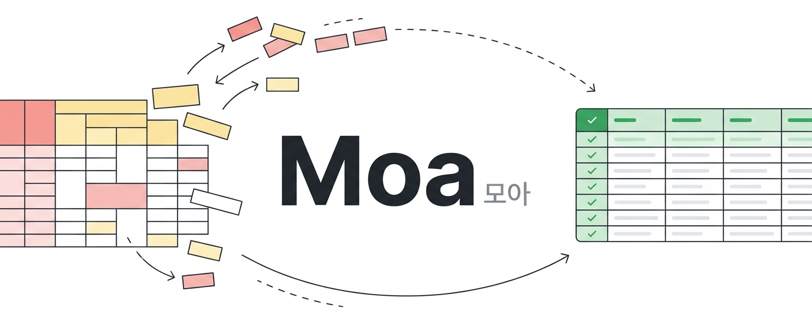
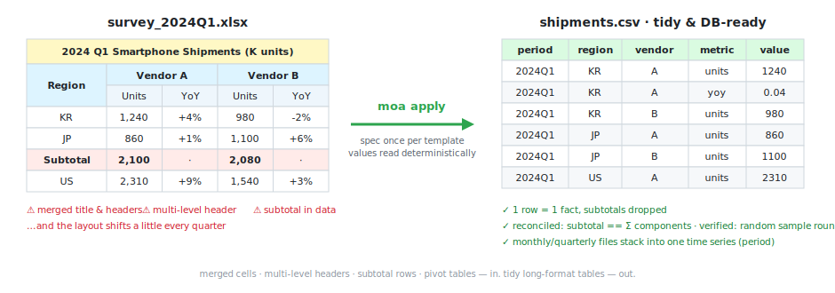

<p align="center">
  
</p>

<p align="center"><a href="README.md">English</a> · <b>한국어</b></p>

<p align="center">
  <b>복잡한 조사기관 Excel을 <code>xlwings</code>만으로 깔끔한 DB용 테이블로 <i>모아</i> 정리.</b>
</p>

<p align="center">
  <a href="https://github.com/Judy-0509/moa/actions/workflows/ci.yml"></a>
  
  
  
  
  
  <a href="https://github.com/Judy-0509/moa/releases"></a>
</p>

<p align="center"><sub><b>Moa(모아)</b> — "모으다"에서: 흩어진 엑셀을 하나의 깨끗한 DB로 모읍니다.<br>
CLI 명령은 <code>moa</code> (레거시 <code>xltidy</code> 명령도 동작하며, 패키지는 <code>moa</code>로 import).</sub></p>

<p align="center"><sub>🚧 <b>Status:</b> 초기 버전(v0.1.x)입니다 — CLI는 끝까지 동작하며 API는 바뀔 수 있어요. 이슈·피드백 환영!</sub></p>

---

## 이게 뭔가요?

**Moa(모아)** 는 조사기관에서 받는 **복잡한 Excel**(병합셀·다중헤더·소계행·피벗·월/분기 반복 양식)을 `openpyxl` 없이 **깔끔한 DB용 tidy 테이블**로 *모아* 정리하는 도구입니다.

`xlwings`로 **살아있는 Excel을 직접** 읽어(수식 계산값·서식·피벗이 모두 실제값) 재사용 가능한 **`TemplateSpec`** 을 결정론적으로 적용합니다.

- **워크북 1개 → 출력 폴더 1개** (시트/표마다 tidy CSV·Parquet 파일) — *"엑셀 1개 = DB 1개"*.
- **일반 표**: LLM(사내 Qwen 또는 [opencode](https://opencode.ai)/Claude 에이전트)이 양식당 **한 번 구조만** 추론하고, 실제 숫자값은 좌표에서 **결정론적으로** 읽습니다 — **LLM은 값을 전사하지 않습니다**.
- **피벗 테이블**: Excel COM(`PivotTables`)으로 **네이티브 추출**. 읽기 전에 **보고서 필터·숨김 항목·슬라이서를 모두 해제**해 필터된 화면이 아니라 **전체 데이터**를 가져옵니다.
- **버전 통합**: 월/분기 파일을 `period` 차원으로 한 시계열에 쌓고, 새 파일이 양식과 어긋나거나(컬럼 이름변경·시트 누락·영역 이동) 두 버전의 **period가 겹치거나 비면** 플래그합니다.
- **무결성 우선**: 매 실행마다 정합성 검증(표 소계 == 구성합, 피벗 데이터합 == 총합계) + **출력 검증 기본 수행**(개수 + 랜덤 샘플 왕복).
- **파일당 1회만 열기**: 파일을 한 번만 열고 헤드리스 Excel 프로세스를 항상 종료 — 좀비 `EXCEL.EXE` 없음.

데이터가 **사내 밖으로 나가지 않는** 온프렘 환경을 전제로 설계되어, 자체 호스팅 Qwen과 함께 쓰고 **opencode/Claude 스킬**로 제공됩니다.

<p align="center">
  
</p>

## 만든 이유

저는 Market Intelligence 애널리스트입니다. 조사기관에서 매달 받는 엑셀은 보기엔 좋지만 분석하기엔 최악이었습니다 — 병합셀, 3단 헤더, 데이터 사이에 끼어 있는 소계 행, 그리고 분기마다 조금씩 달라지는 양식. 손으로 정리하면 몇 시간씩 걸렸고, 셀 하나만 잘못 옮겨도 시계열 전체가 조용히 오염됐습니다. Moa는 그래서 만들었습니다: 양식을 **한 번만** 정의하면, 이후의 모든 파일이 동일한 **검증된** 테이블로 정리됩니다.
게다가 이 문제를 더 어렵게 만드는 제약이 있습니다: 조사기관 엑셀은 보안상 사외로 나갈 수 없어서 클라우드 AI는 선택지가 아닙니다. Moa는 데이터가 있는 곳에서 — 온프렘 에이전트와 사내 LLM 곁에서 — 돌아가도록 만들어졌습니다.


---

## 동작 원리

```
0) moa sheets <파일>  ─▶  모든 시트(숨김 포함) 나열  ─▶  [사용자가 DB화할 시트 선택]
                                                            │
   선택 시트별로:                                            ▼
   kind=table:  extract (xlwings) ─▶ CellGrid ─ encode ─▶ [agent/Qwen] ─▶ TableSpec   (구조만)
   kind=pivot:  pivot (COM, 필터 해제) ────────────────────────────────▶ TableSpec   (LLM 건너뜀)
                                                            │
   각 월/분기 파일 + TemplateSpec ─ apply ─▶ {표이름: tidy long(+period)} + reconcile + verify
                                                            │
   여러 파일 ─ consolidate ─▶ 표별 period 누적 + 드리프트/period 검사 ─▶ 출력 폴더 (<table>.csv/.parquet)
```

LLM은 `TemplateSpec`(좌표·구조)만 만들고, 실제 값은 결정론 코드가 읽습니다.

> 아래 모든 명령은 **PowerShell**(Windows) 기준입니다.

## 설치

```powershell
python -m pip install -e ".[dev]"
# + Parquet 출력:          python -m pip install -e ".[dev,parquet]"
# + 사내 Qwen 백엔드:       python -m pip install -e ".[dev,parquet,qwen]"
```

**`moa`** 명령(과 레거시 `xltidy` 별칭)이 설치됩니다. 요구사항: **Python 3.10+**, COM 기능(`sheets` / `extract` / `apply`·`consolidate`의 피벗)에는 **Microsoft Excel이 설치된 Windows**가 필요합니다.

## 사내 설치 (PowerShell)

```powershell
# 1) 레포 클론
git clone https://github.com/Judy-0509/moa.git
Set-Location moa

# 2) 가상환경 권장
python -m venv .venv
.\.venv\Scripts\Activate.ps1

# 3) 설치 (Parquet + 사내 Qwen 백엔드 포함)
python -m pip install -e ".[dev,parquet,qwen]"

# 4) 사내 Qwen(OpenAI 호환) 연결
#    이 세션만:
$env:MOA_QWEN_BASE_URL = "http://qwen.example.internal/v1"
$env:MOA_QWEN_API_KEY  = "your-internal-key"
$env:MOA_QWEN_MODEL    = "qwen2.5-72b-instruct"
#    사용자 환경변수로 영구 저장 (새 셸에도 적용):
[Environment]::SetEnvironmentVariable("MOA_QWEN_BASE_URL", "http://qwen.example.internal/v1", "User")
[Environment]::SetEnvironmentVariable("MOA_QWEN_MODEL", "qwen2.5-72b-instruct", "User")

# 5) 설치 점검
python -m pytest -m "not excel" -q     # 코어, Excel 불필요
python -m pytest -m excel -q           # COM (데스크톱 Excel 필요)
```

> **opencode/Claude 에이전트**로 쓰면 `qwen` 백엔드·환경변수가 필요 없습니다(에이전트 LLM이 스펙 작성). 설치(3단계에서 `,qwen` 제외) 후 스킬만 등록하세요(아래 참고).

## 빠른 시작

```powershell
# 0) 시트 선택 — 숨김·very_hidden 포함 전체 시트 확인
moa sheets report_2024Q1.xlsx

# 1) 양식당 1회 TemplateSpec 작성
#    표 시트: 에이전트가 spec.yaml을 채우도록 인코딩 출력
moa infer report_2024Q1.xlsx --sheet 데이터 --backend agent
moa sample-spec            # YAML 골격이 필요하면 출력
#    피벗 시트: 스펙에 kind:pivot + pivot_name + period 만 작성
#    (추출 시 필터 자동 해제)

# 2) 검증
moa spec-validate specs/employment.yaml --against report_2024Q1.xlsx --sheet 데이터

# 3) 단일 적용 — 워크북 1개 → tidy 테이블 폴더 1개
moa apply specs/employment.yaml --file report_2024Q1.xlsx --out-dir out/2024Q1 --format csv

# 4) 월/분기 버전 통합
moa consolidate specs/employment.yaml "data/2024*.xlsx" --out-dir merged --format parquet --on-drift stop
```

정합성 불일치(소계 ≠ 합, 피벗 데이터 ≠ 총합계), 드리프트(헤더 이름변경, 선택 시트 누락), period 충돌(두 버전이 같은/미해석 period로 해석)이 보고되며, `--on-drift stop`이면 어긋난 파일은 적재되지 않습니다.

**출력 검증이 기본 수행**됩니다 — 행 개수 확인 + 랜덤 **샘플 왕복**(원본 셀 → 출력). 소계가 없는 시트에서도 동작합니다. `--sample N`으로 샘플 셀 수 지정(`0` = 전체 확인), `--no-verify`로 생략.

## opencode / Claude 스킬로 사용

스킬은 [`.opencode/skills/moa/SKILL.md`](.opencode/skills/moa/SKILL.md)에 들어 있어(폴더명 = 스킬 `name`), 이 레포를 opencode로 열면 프로젝트 스킬로 **자동 로드**됩니다. 다른 곳에서 쓰려면 폴더째 복사 (PowerShell):

```powershell
# opencode 전역
$dst = "$env:USERPROFILE\.config\opencode\skills\moa"
New-Item -ItemType Directory -Force -Path $dst | Out-Null
Copy-Item ".\.opencode\skills\moa\SKILL.md" "$dst\SKILL.md" -Force

# Claude 프로젝트별
New-Item -ItemType Directory -Force -Path ".\.claude\skills\moa" | Out-Null
Copy-Item ".\.opencode\skills\moa\SKILL.md" ".\.claude\skills\moa\SKILL.md" -Force
```

이후 opencode에서 에이전트가 `skill({ name: "moa" })`로 호출합니다.

### `/moa` 슬래시 명령

**skill**은 에이전트가 자동 호출하고(자연어로 요청하면 모델이 로드), **command**는 사용자가 **`/moa`** 로 직접 호출합니다 — [`.opencode/commands/moa.md`](.opencode/commands/moa.md)에 독립 실행형으로 들어 있습니다.

- 이 레포를 opencode로 열면 `/moa <파일>`이 바로 동작합니다 (스킬 복사·Qwen API 불필요, opencode 자체 모델이 수행).
- 전역 사용:

```powershell
$cmd = "$env:USERPROFILE\.config\opencode\commands"
New-Item -ItemType Directory -Force -Path $cmd | Out-Null
Copy-Item ".\.opencode\commands\moa.md" "$cmd\moa.md" -Force
```

스킬이 전체 워크플로(시트 선택 → 스펙 작성 → apply → consolidate)를 수행하며, 에이전트 자체가 LLM(사내 Qwen 등) 위에서 돌므로 별도 Qwen 호출이 필요 없습니다.

## 제약

- **xlwings 전용.** `openpyxl`, `pandas.read_excel`/`ExcelFile`은 하드 금지이며 `tests/test_no_openpyxl.py` 가드 테스트로 강제됩니다.
- 무인 추론은 사내 **Qwen** 백엔드(`--backend qwen`)를 사용하며 `MOA_QWEN_BASE_URL`, `MOA_QWEN_API_KEY`, `MOA_QWEN_MODEL`로 설정합니다 (레거시 `XLTIDY_*` 이름도 계속 동작).
- 피벗 추출은 모든 필터를 해제하며 v1에서는 **단일 데이터 필드**만 지원합니다 (다중 필드 피벗은 경고 후 첫 필드 사용).
- 병합 감지는 라벨/헤더 앵커(문자·날짜) 기준만 지원 — **순수 숫자 앵커 병합**과 **숫자 본문 병합**은 미지원 (값 셀은 셀 단위로 읽음).

## 테스트

```powershell
python -m pytest -m "not excel"   # 코어 (순수) — Excel 불필요
python -m pytest -m excel         # COM (extract/pivot/e2e) — 데스크톱 Excel 필요
```

## 프로젝트 구조

```
src/moa/                        (패키지는 `moa`로 import; CLI 명령은 `moa`)
  coords.py       A1 <-> (row, col)
  models.py       Cell, MergedRange, CellGrid (value_filled = merge->anchor), SheetInfo
  encode.py       CellGrid -> LLM용 압축 텍스트 (숫자는 #num 마스킹; 큰 시트는 head/tail 샘플)
  spec.py         TemplateSpec / SheetSpec / TableSpec (kind: table | pivot)
  reconcile.py    표 소계==합 · 피벗 데이터==총합계
  verify.py       독립 출력 검증 (행 개수 + 랜덤 샘플 왕복)
  apply.py        apply_table / finalize_pivot / apply_session / apply_workbook
  dbio.py         write_tables -> 워크북별 CSV/Parquet 폴더
  consolidate.py  detect_drift (시트/컬럼/영역) + period 충돌 가드 + consolidate
  config.py       MOA_QWEN_* 환경변수
  infer.py        에이전트 프롬프트 빌더 + 선택적 Qwen 백엔드
  _xl.py          헤드리스 Excel 수명주기: new_app / quit_app (kill 백스톱) / open_book
  session.py      ExcelSession (워크북 1회 열기, 시트별 그리드 캐시) + FnSession 어댑터
  extract.py      xlwings: list_sheets (숨김 포함) + extract / grid_from_sheet
  pivot.py        COM PivotTables 네이티브 피벗 추출 (모든 필터 해제)
  cli.py          typer CLI
.opencode/skills/moa/SKILL.md      opencode 스킬 (자동 로드; 폴더명 = 스킬 이름)
.opencode/commands/moa.md          /moa 슬래시 명령
docs/superpowers/                  설계 스펙 + 구현 계획
```

## 로드맵

SQL DB 어댑터(SQLite/Postgres), 휴리스틱 표 자동 감지, MCP 서버, 서버/헤드리스 배치, 자연어→SQL, 다중 데이터필드 피벗.

## 참고

- 설계 스펙: [`docs/superpowers/specs/2026-06-10-xltidy-excel-to-db-design.md`](docs/superpowers/specs/2026-06-10-xltidy-excel-to-db-design.md)
- 구현 계획: [`docs/superpowers/plans/2026-06-10-xltidy.md`](docs/superpowers/plans/2026-06-10-xltidy.md)
- [exstruct](https://github.com/harumiWeb/exstruct)에서 영감 (Excel → LLM/RAG용 구조화 JSON).

## License

[MIT](LICENSE) © 2026 Judy-0509
